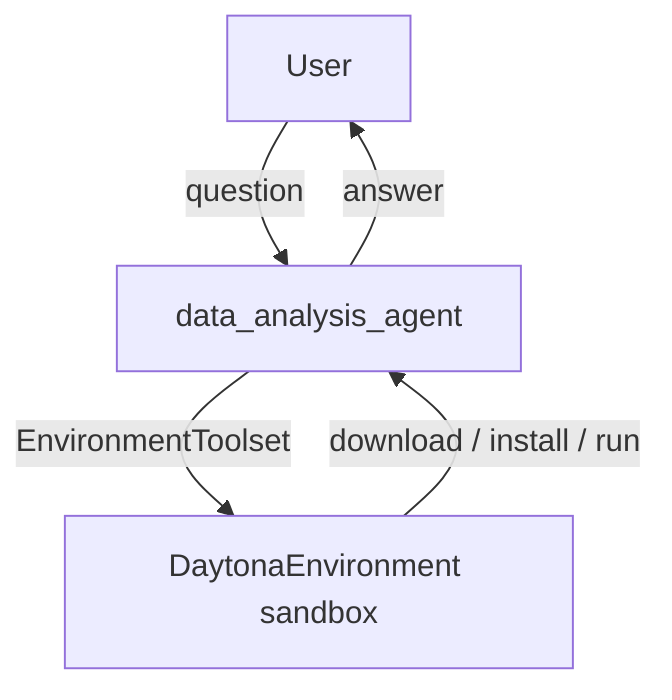

# Daytona Environment Sample

## Overview

A small data analysis agent that uses the `DaytonaEnvironment` with the
`EnvironmentToolset` to download public datasets and analyze them inside a
[Daytona](https://daytona.io) remote sandbox.

Instead of running on the local machine, all commands and file operations
execute in an isolated remote sandbox with internet access. Asked a question,
the agent downloads a public dataset (a GCS-hosted world population /
demographics dataset by default), installs `pandas` on demand, writes a short
analysis script, runs it, and reports the result — all without touching the
user's machine. This makes the sandbox a natural fit for running
model-generated code safely and keeping the host clean.

## Prerequisites

1. Install the `daytona` extra:

   ```bash
   pip install google-adk[daytona]
   ```

1. Set your Daytona configuration. Get a server and API key by following the
   Daytona installation guide (e.g. self-hosted or via Daytona Cloud).

   If you are using Daytona Cloud, you only need to set:

   ```bash
   export DAYTONA_API_KEY="your-api-key"
   ```

   If you are using a self-hosted Daytona server, also set:

   ```bash
   export DAYTONA_API_URL="your-api-url"
   ```

## Sample Inputs

- `Download the world demographics dataset and tell me which country has the largest population.`

  The agent downloads the dataset, installs `pandas`, filters to country-level
  rows, and finds the maximum. Expected: China (`CN`), ≈ 1.44 billion, just
  ahead of India (`IN`) at ≈ 1.38 billion.

- `For the United States, what is the urban vs rural population split?`

  A follow-up to the previous turn. Because the sandbox persists across the
  session, the agent reuses the already-downloaded CSV and the installed
  `pandas` — it only writes and runs a new script. Expected for `US`: urban
  ≈ 270.7 million vs rural ≈ 57.6 million (out of ≈ 331 million total).

- `Using https://storage.googleapis.com/cloud-samples-data/bigquery/us-states/us-states.csv, how many US states are listed?`

  Demonstrates pointing the agent at your own dataset URL instead of the
  default.

## Graph



## How To

The agent is a standalone `Agent` (no workflow graph) wired to a single
`EnvironmentToolset` whose `environment` is a `DaytonaEnvironment`:

```python
from google.adk.integrations.daytona import DaytonaEnvironment
from google.adk.tools.environment import EnvironmentToolset

EnvironmentToolset(
    environment=DaytonaEnvironment(timeout=300),
)
```

- `timeout` bounds the sandbox lifetime in seconds.
- By default, it will spin up a sandbox from the built-in default Python snapshot.
  If you want to use a custom Docker image instead, you can pass it to the
  `image` parameter (e.g. `image="python:3.12"`).
