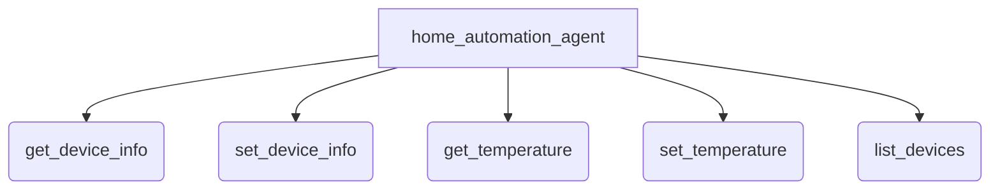

# ADK evaluation samples

## Overview

A family of single-concept samples that each show one way to evaluate the *same*
shared home-automation agent with the `adk eval` CLI. Every sample points `adk eval` at one agent and differs only in its eval data and criteria, so you can
compare evaluation techniques (deterministic reference matching, custom metrics,
LLM-as-a-judge, rubrics, and user simulation) side by side.

## The shared agent

`home_automation_agent/` is a small agent that controls smart-home devices and
temperatures. Its five tools (`get_device_info`, `set_device_info`,
`get_temperature`, `set_temperature`, `list_devices`) are deterministic, backed by
in-memory state, so eval trajectories are reproducible. The module exposes
`reset_data()`, which `adk eval` calls to reset that state between eval cases.

Every sample evaluates this same agent. `adk eval` takes the agent path and the
eval-set path as two separate arguments, so each sub-sample folder holds only
eval data and its criteria config, never a copy of the agent code.

## How evaluation runs

`adk eval` runs in two phases: (1) live inference, where it actually runs the
agent against each eval input to produce responses and tool calls, and then (2)
scoring, where it compares that output against the case's criteria. Because phase 1
runs the real agent, a model credential is required for every sample, even the
deterministic ones. Provide a Gemini API key in `home_automation_agent/.env`,
or configure Vertex.
Samples that use an LLM judge or a user simulator make additional model calls, but
they resolve through the same model registry and credentials.

Because live responses vary from run to run, the deterministic, reference-based
criteria use lenient response thresholds (e.g. `response_match_score` at
`0.5`) so that harmless phrasing differences don't fail an otherwise-correct
answer.

## Samples

| Sample | Concept | Criteria |
| ------ | ------- | -------- |

## Graph

## Related Guides

- Evaluation overview: https://adk.dev/evaluate/
- Evaluation criteria reference: https://adk.dev/evaluate/criteria/
- User simulation guide: https://adk.dev/evaluate/user-sim/
