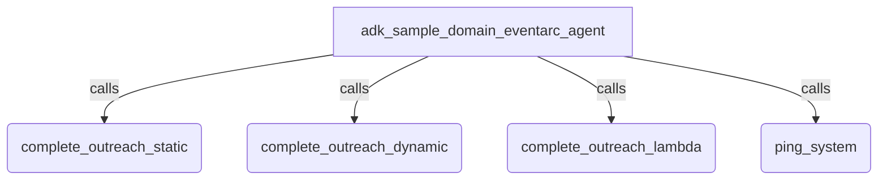

# Eventarc Domain-Specific Agent Sample

## Overview

This sample agent demonstrates the `create_publish_tool` factory from the Eventarc first-party tool suite in ADK (`google.adk.integrations.eventarc`). It shows how to create domain-specific, strict-schema publishing tools. This allows you to lock down event routing parameters (e.g. `bus`, `type`, `source`) using `CloudEventAttributesBinding` to static values, runtime lambdas, or selectively-exposed agent fields (`AgentProvided`), while binding the event payload to a strictly validated Pydantic model. This prevents hallucinated routing destinations and guarantees structured JSON event data matching your business domain.

## Sample Inputs

- `We just successfully completed a vendor outreach call with customer CUST-883. Resolution notes: All issues resolved.`

- `Log a dynamic outreach event for customer CUST-992. It should go to the message bus 'projects/your_project/locations/us-central1/messageBuses/outreach-bus' and the subject is 'urgent-outreach'.`

- `We just successfully completed a vendor outreach call with customer CUST-123. Resolution notes: All issues resolved. This is a high priority outreach.`

- `Please ping the system with high priority, do not retry.`

## Graph



## How To

### Prerequisites: Set up Eventarc

Before running the agent, you must enable the Eventarc APIs and create a target Message Bus in your Google Cloud Project.

1. Enable the Eventarc APIs:

```bash
gcloud services enable eventarc.googleapis.com eventarcpublishing.googleapis.com
```

2. Create a Message Bus:

```bash
gcloud eventarc message-buses create my-bus \
    --location=us-central1 \
    --logging-config=DEBUG
```

*(Make sure to update the `BUS_NAME` variable in `agent.py` to match your actual bus URI).*

`create_publish_tool` is highly flexible. It uses `pydantic.create_model` to construct the LLM's function signature, encapsulating the `payload_schema` inside an `event_data` parameter and appending any parameter marked with `AgentProvided`.

### Example A: Fully Statically Bound (Safest)

The developer locks down all routing. The agent only provides the business data.

```python
complete_outreach_static_tool = toolset.create_publish_tool(
    name="complete_outreach_static",
    description="Logs a completed outreach attempt (statically bound routing).",
    payload_schema=OutreachContext,
    bus=f"projects/{PROJECT_ID}/locations/us-central1/messageBuses/{BUS_NAME}",
    ce_attributes_binding=CloudEventAttributesBinding(
        type="vendor_outreach.completed",
        source="//my-agent/outreach",
    )
)
```

**What the Agent Sees:** `complete_outreach_static(event_data: OutreachContext)`

### Example B: Agent-Provided Attributes (Dynamic)

The developer forces the agent to decide the routing bus and the event subject based on the conversation context.

```python
complete_outreach_dynamic_tool = toolset.create_publish_tool(
    name="complete_outreach_dynamic",
    description="Logs a completed outreach attempt (dynamic routing).",
    payload_schema=OutreachContext,
    bus=AgentProvided("The full regional bus name"),
    ce_attributes_binding=CloudEventAttributesBinding(
        type="vendor_outreach.completed",
        source="//my-agent/outreach",
        subject=AgentProvided("The unique Customer ID being reached out to.")
    )
)
```

**What the Agent Sees:** `complete_outreach_dynamic(event_data: OutreachContext, bus: str, subject: str)`

### Example C: Lambda Execution & Mixed Custom Attributes

The developer uses Python callables to generate IDs dynamically at runtime.

```python
def get_custom_trace_id(payload: OutreachContext) -> str:
    return f"trace-{payload.customer_id}-{uuid.uuid4().hex[:8]}"

complete_outreach_lambda_tool = toolset.create_publish_tool(
    name="complete_outreach_lambda",
    description="Logs a completed outreach attempt.",
    payload_schema=OutreachContext,
    bus=f"projects/{PROJECT_ID}/locations/us-central1/messageBuses/{BUS_NAME}",
    ce_attributes_binding=CloudEventAttributesBinding(
        type="vendor_outreach.completed",
        source="//my-agent/outreach",
        id=get_custom_trace_id, # Executed at runtime
        custom_attributes={
            "environment": "production", # Statically bound
            "priority": AgentProvided("The priority of the outreach: 'high' or 'low'")
        }
    )
)
```

**What the Agent Sees:** `complete_outreach_lambda(event_data: OutreachContext, priority: str)`

### Example D: Empty Payloads & Dynamic Defaults

The developer wants to emit a simple signal (no business payload). If the agent omits the priority, it is dynamically calculated.

```python
def default_priority(_: None) -> str:
    return "low"

ping_system_tool = toolset.create_publish_tool(
    name="ping_system",
    description="Pings the system. No data required.",
    payload_schema=None, # No payload!
    bus=f"projects/{PROJECT_ID}/locations/us-central1/messageBuses/{BUS_NAME}",
    ce_attributes_binding=CloudEventAttributesBinding(
        type="system.ping",
        source="//my-agent/ping",
        custom_attributes={
            "retry": AgentProvided("Whether to retry on failure", default="false"),
            "priority": AgentProvided("The priority of the ping", default=default_priority)
        }
    )
)
```

**What the Agent Sees:** `ping_system(retry: str = "false", priority: str | None = None)`

### Example E: Handling Reserved Keywords and Strict Validation

`create_publish_tool` strictly validates custom attributes to ensure they comply with the CloudEvent specification. If your custom attribute name collides with a Python reserved keyword, an implicit pointer, or starts with a digit, the tool factory automatically handles this. It securely modifies the exposed parameter name for the LLM (e.g., `self_` or `_123foo`) to avoid collisions, and translates it back during runtime execution.

## Next Steps: Building Event-Driven AI Workflows

Publishing an event to a Message Bus is only the first half of the journey. To route these events to other agents or microservices, you will need to set up Eventarc Pipelines and Enrollments.

To learn how to connect multiple AI agents together using Eventarc, check out the official codelab: **[Build Event-Driven AI Agents with Eventarc, Cloud Run and ADK](https://codelabs.devsite.corp.google.com/eventarc-ai-agents#0)**.
