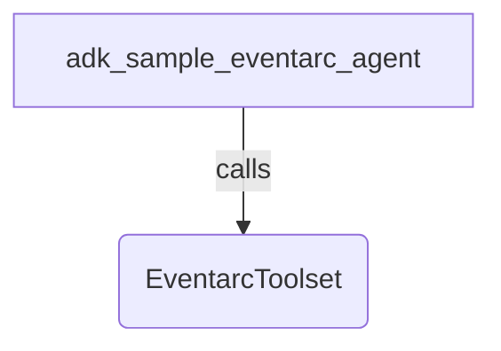

# Eventarc Generic Agent Sample

## Overview

This sample agent demonstrates the Eventarc first-party tool in ADK, distributed via the `google.adk.integrations.eventarc` module. It uses the `publish_message` tool to publish a structured event in CloudEvents format asynchronously to a Google Cloud Eventarc message bus. This exposes the full CloudEvent spec to the agent with connection pooling and caching across calls.

## Sample Inputs

- `Publish an event of type 'com.example.hello' to bus 'projects/my-project/locations/global/messageBuses/my-bus' with data 'Hello World' and source '//my/agent'`

- `Send a JSON payload to Eventarc bus 'projects/my-project/locations/global/messageBuses/my-bus' representing a user sign-up event`

## Graph



## How To

### Prerequisites: Set up Eventarc

Before running the agent, you must enable the Eventarc APIs and create a target Message Bus in your Google Cloud Project.

1. Enable the Eventarc APIs:

```bash
gcloud services enable eventarc.googleapis.com eventarcpublishing.googleapis.com
```

2. Create a Message Bus:

```bash
gcloud eventarc message-buses create my-bus \
    --location=us-central1 \
    --logging-config=DEBUG
```

*(Make sure to update the `BUS_NAME` variable in `agent.py` to match your actual bus URI).*

Set up environment variables in your `.env` file for using Google AI Studio or Google Cloud Vertex AI for the LLM service. For example:

- `GOOGLE_GENAI_USE_VERTEXAI=FALSE`
- `GOOGLE_API_KEY={your api key}`

### With Application Default Credentials

This mode is useful for quick development when the agent builder is the only user interacting with the agent.

1. Create application default credentials on the machine where the agent would be running (https://cloud.google.com/docs/authentication/provide-credentials-adc).
1. Set `CREDENTIALS_TYPE=None` in `agent.py`.
1. Run the agent.

### With Service Account Keys

This mode is useful for running the agent with service account credentials.

1. Create a service account key (https://cloud.google.com/iam/docs/service-account-creds#user-managed-keys).
1. Set `CREDENTIALS_TYPE=AuthCredentialTypes.SERVICE_ACCOUNT` in `agent.py`.
1. Download the key file and replace `"service_account_key.json"` with the path.
1. Run the agent.

### With Interactive OAuth

1. Obtain OAuth 2.0 credentials from the Google Cloud Console. Choose "web" as your client type.
1. Configure OAuth consent to add scope "https://www.googleapis.com/auth/cloud-platform".
1. Add `http://localhost/dev-ui/` to "Authorized redirect URIs".
1. Configure your `.env` file with `OAUTH_CLIENT_ID` and `OAUTH_CLIENT_SECRET`.
1. Set `CREDENTIALS_TYPE=AuthCredentialTypes.OAUTH2` in `agent.py` and run the agent.

### With Agent Identity (in Agent Runtime / Vertex AI Reasoning Engine)

When deploying this agent to Agent Runtime, it can use its unique SPIFFE-based Agent Identity to authenticate.

1. **Configure Deployment**: Create a `.agent_engine_config.json` file in the specific agent's directory to specify `"identity_type": "AGENT_IDENTITY"`.
1. **Use Default Credentials**: Leave `CREDENTIALS_TYPE = None` in `agent.py`.
1. **Deploy the Agent**: Deploy your agent using the ADK CLI:
   ```bash
   uv run adk deploy agent_engine \
     --project=YOUR_PROJECT_ID \
     --region=YOUR_REGION \
     --display_name=eventarc-agent-test \
     contributing/samples/integrations/eventarc/generic_agent
   ```
1. **Grant IAM Permissions**: Grant the Eventarc Message Bus User role (`roles/eventarc.messageBusUser`) to the Agent Identity principal at the project level.

## Next Steps: Building Event-Driven AI Workflows

Publishing an event to a Message Bus is only the first half of the journey. To route these events to other agents or microservices, you will need to set up Eventarc Pipelines and Enrollments.

To learn how to connect multiple AI agents together using Eventarc, check out the official codelab: **[Build Event-Driven AI Agents with Eventarc, Cloud Run and ADK](https://codelabs.devsite.corp.google.com/eventarc-ai-agents#0)**.
