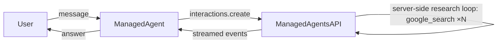

# Managed Agent

## Overview

This sample runs a `ManagedAgent` configured with the built-in `google_search`
tool. Given an open-ended request, the server-side harness autonomously issues
many searches and synthesizes the result in a single turn.

## Sample Inputs

- `Compare the current flagship smartphones from Apple, Samsung, and Google. For each, find its launch price, display size, and main rear camera resolution, then recommend the best value for someone who mostly takes photos.`

  The showcase input. A single question the harness answers by fanning out into a
  dozen-odd searches. It does broad discovery first, then targeted per-model spec
  and price lookups, self-correcting when it hits a stale model, before composing
  a comparison table and a reasoned recommendation.

- `Which of those would you pick for shooting video instead?`

  A follow-up turn that reuses the recovered remote sandbox and the previous
  interaction, continuing the same research thread. This demonstrates multi-turn
  chaining.

## Graph

## How To

- **Create the agent**: instantiate `ManagedAgent` with an `agent_id`, an
  `environment` spec, and a list of server-side `tools`. No `model` is set; the
  model is part of the managed agent on the server.
- **Provision a sandbox**: `environment={'type': 'remote'}` requests a fresh
  remote sandbox. The resulting environment id is stored on emitted events, so
  subsequent turns automatically recover and reuse it.
- **Multi-turn chaining**: the agent recovers the `previous_interaction_id` from
  the session events, so follow-up turns continue the same interaction without
  any extra wiring.
- **Drive it**: a `ManagedAgent` is a `BaseAgent`, so a standard `Runner` runs
  it just like any other agent.
