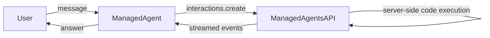

# Managed Agent - Code Execution

## Overview

This sample runs a `ManagedAgent` configured with the built-in **code execution**
tool so it can write and run code server-side to compute answers.

Unlike a regular `LlmAgent` (which enables code execution via
`code_executor=BuiltInCodeExecutor()`), `ManagedAgent` has no `code_executor`
field. Instead you pass the raw built-in tool config
`types.Tool(code_execution=types.ToolCodeExecution())` in `tools` -- the same
config `BuiltInCodeExecutor` produces under the hood. This makes the sample a
demonstration of the raw `types.Tool` server-side tool path.

## Sample Inputs

- `What is the sum of the first 50 prime numbers? Use code to compute it.`

  The model writes and runs code server-side; the answer (5117) comes from the
  executed code rather than the model guessing.

- `Now do the same for the first 100 primes.`

  A follow-up turn that reuses the recovered remote sandbox and the previous
  interaction (answer: 24133), demonstrating multi-turn chaining.

## Graph

## How To

- **Create the agent**: instantiate `ManagedAgent` with an `agent_id`, an
  `environment` spec, and
  `tools=[types.Tool(code_execution=types.ToolCodeExecution())]`. No `model` is
  set -- the model is part of the managed agent on the server.
- **Enable code execution**: `ManagedAgent` has no `code_executor` field, so the
  raw `types.Tool(code_execution=...)` config is passed in `tools`. The
  interactions converter turns it into the server-side `code_execution` tool.
- **Provision a sandbox**: `environment={'type': 'remote'}` requests a fresh
  remote sandbox. The resulting environment id is stored on emitted events, so
  subsequent turns automatically recover and reuse it.
- **Multi-turn chaining**: the agent recovers the `previous_interaction_id` from
  the session events, so follow-up turns continue the same interaction without
  any extra wiring.
- **Drive it**: a `ManagedAgent` is a `BaseAgent`, so a standard `Runner` runs
  it just like any other agent.
