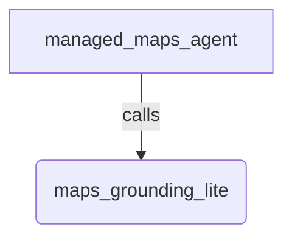

# Managed Agent - Remote MCP (Maps Grounding Lite)

## Overview

This sample runs a `ManagedAgent` wired to a remote MCP server: Google Maps
Platform Grounding Lite (`https://mapstools.mtls.googleapis.com/mcp`). The MCP server
is executed server-side. `ManagedAgent` forwards the server URL and auth headers
to the Managed Agents API, and the backend opens the MCP session and calls the
Maps tools (`search_places`, `lookup_weather`, `compute_routes`).

Unlike `LlmAgent`'s `McpToolset`, which opens the MCP session and runs tools
client-side, ADK never connects to the MCP server here. Authentication uses a
`header_provider` callback that returns the `X-Goog-Api-Key` header at runtime
from the `GOOGLE_MAPS_API_KEY` environment variable, using the same callback
contract as `LlmAgent`'s `McpToolset.header_provider`.

## Setup

1. Enable the Maps Grounding Lite service on your Google Cloud project and obtain
   an API key (see https://developers.google.com/maps/ai/grounding-lite). For
   testing you may use the Maps Demo Key.

1. Set the key in your environment (or a `.env` in this directory):

   ```bash
   export GOOGLE_MAPS_API_KEY="YOUR_MAPS_API_KEY"
   ```

1. Ensure Managed Agents / interactions auth (ADC) is configured, as with the
   other `managed_agent` samples.

Note: Maps Grounding Lite may only be used with an LLM that complies with the
Google Maps Platform Terms of Service (no training or caching of Maps content).
The managed-agent backend model is the LLM in this path.

## Sample Inputs

- `Find a few coffee shops near Golden Gate Park.`

  The backend calls the `search_places` MCP tool and grounds the answer in Maps
  results.

- `What's the weather in San Francisco tomorrow?`

  A follow-up turn that reuses the previous interaction, calling the
  `lookup_weather` MCP tool.

## Graph



## How To

- Create the agent: instantiate `ManagedAgent` with an `agent_id` and a
  `RemoteMcpServer` in `tools`.
- Declare the MCP server: `RemoteMcpServer(name=..., url=..., header_provider=...)`. Only remote (HTTP/streamable) MCP servers are supported,
  and execution is server-side.
- Mint auth at runtime: the `header_provider` callback runs during resolution
  each turn and returns the headers sent to the MCP server, here
  `{'X-Goog-Api-Key': <GOOGLE_MAPS_API_KEY>}`.
