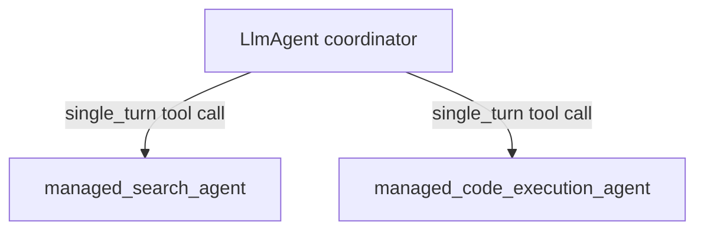

# Managed Agent — Single-Turn Sub-Agent (Tool) Flow

> For setup, authentication, backends, and background on `ManagedAgent`, see the
> [ManagedAgent guide](../../../../docs/guides/agents/managed_agent/index.md).

## Overview

This sample shows a local `LlmAgent` coordinator that calls two server-backed
`ManagedAgent` specialists as single-turn sub-agents (`mode='single_turn'`).
ADK auto-exposes each single-turn sub-agent to the coordinator as an inline tool.
The coordinator calls a specialist, receives the result, and may call several
specialists in one turn before composing the final answer itself.

A single-turn sub-agent's internal events (e.g. tool calls) are preserved in the
shared session history.

The two specialists are:

- `managed_search_agent` — a `ManagedAgent` with the server-side `google_search`
  tool, for questions that require web search results.
- `managed_code_execution_agent` — a `ManagedAgent` with server-side code
  execution, for questions that require computation.

> [!NOTE]
> Each `ManagedAgent` sets a `description`; ADK builds the tool declaration from
> it, so a missing description makes tool selection unreliable.

> [!NOTE]
> Each single-turn call is stateless and isolated, so the coordinator should
> pass a self-contained request to each specialist (do not rely on a specialist
> remembering a previous call).

## Sample Inputs

- `What was the score of the most recent FIFA World Cup final?`

  Requires web search results — the coordinator calls `managed_search_agent`.

- `What's the 30th Fibonacci number? Use code.`

  Requires computation — the coordinator calls `managed_code_execution_agent`
  (answer: 832040).

- `Look up the height of Mount Everest in meters, then use code to convert it to feet.`

  The coordinator calls both specialists in one turn (search for the height,
  then code to multiply by 3.28084) and composes a single answer.

## Graph

## How To

- Coordinator: an `LlmAgent` with a non-empty `sub_agents` list of single-turn
  specialists.
- Specialists: each is a `ManagedAgent` with `mode='single_turn'`, an
  `agent_id`, an `environment` spec, server-side `tools`, and a `description`
  used for tool selection.
- Delegation: ADK exposes each single-turn specialist as an inline tool; the
  coordinator calls it, gets the result, and keeps control of the turn.

## Related Guides

- [LlmAgent Single-Turn Mode](../../../../docs/guides/agents/llm_agent/single_turn.md)
