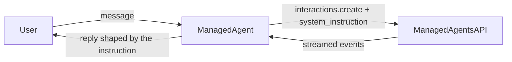

# Managed Agent — System Instruction

> For setup, authentication, backends, and background on `ManagedAgent`, see the
> [ManagedAgent guide](../../../../docs/guides/agents/managed_agent/index.md).

## Overview

This sample runs a `ManagedAgent` whose behavior is shaped by its `instruction`
field. `instruction` is forwarded to the Managed Agents API as the interaction's
system instruction (the same role `LlmAgent.instruction` plays for a local
model). Here it pins a persona and output format, so its effect is visible in
every reply.

`instruction` accepts either a plain string (which may embed `{state_var}`
placeholders resolved from session state) or an `InstructionProvider` callable.
This sample uses an **`InstructionProvider`**: `persona_instruction` takes a
`ReadonlyContext`, reads the reply language from `state['response_language']`
(defaulting to English), and returns the instruction string. Because a provider
is invoked on every turn, the instruction is rebuilt each turn from the current
state; unlike a string, it bypasses `{placeholder}` injection, so you build the
final text yourself. A provider may also be `async` (return an awaitable `str`).

## Sample Inputs

- `What is the capital of France?`

  The reply obeys the instruction: a single terse sentence ending with a
  relevant emoji, in the language from `state['response_language']` (English by
  default).

- `And Japan?`

  A follow-up turn that reuses the recovered remote sandbox and previous
  interaction. The provider runs again on this turn, demonstrating that the
  system instruction is resolved and sent on chained turns too — and would pick
  up any change to `response_language` in session state.

## Graph

## How To

- **Set the instruction**: pass `instruction=...` to `ManagedAgent`. A string is
  sent as-is (after `{placeholder}` resolution); an `InstructionProvider`
  callable is invoked per turn and bypasses placeholder injection.
- **Use an `InstructionProvider`**: define a callable that takes a
  `ReadonlyContext` and returns a `str` (or an awaitable `str`), then pass it as
  `instruction`. Read `readonly_context.state` to build the instruction
  dynamically — here `state['response_language']` selects the reply language.
- **Observe the effect**: every reply follows the persona/format the instruction
  specifies, on the first turn and on chained follow-up turns.
- **Drive it**: a `ManagedAgent` is a `BaseAgent`, so a standard `Runner` runs it
  just like any other agent.
