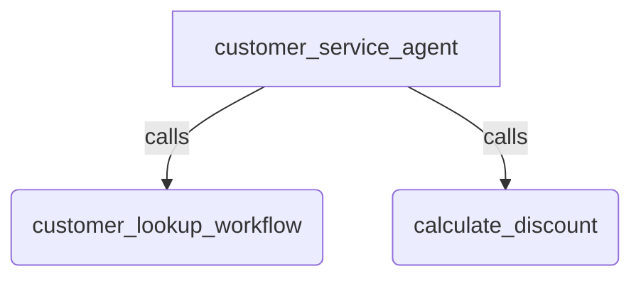

# Node as Tool

## Overview

Demonstrates wrapping both a regular ADK `Node` (using the `@node` decorator) and a `Workflow` as tools that can be automatically called by a parent `Agent`.

In this sample:

1. The parent agent receives an inquiry about a customer's discount.
1. It invokes `customer_lookup_workflow` (a `Workflow` wrapped as a tool) to retrieve customer status.
1. It then invokes `calculate_discount` (a regular `Node` wrapped as a tool) using the retrieved status.

## Sample Inputs

- `What discount does customer c123 get?`

  *The parent agent first invokes `customer_lookup_workflow` to verify status, then invokes `calculate_discount` to determine the discount percentage, and summarizes the results.*

## Agent Topology Graph

## How To

To expose an existing `Node` or `Workflow` as a tool callable by an `Agent`:

1. Define your `Node` (or `@node`) or `Workflow` and assign both an `input_schema` and a `description`.
1. Pass the node/workflow directly into your parent agent's `tools` list: `Agent(..., tools=[my_node, my_workflow])`.

## Related Guides

- [Workflows](../../../../docs/guides/workflows/workflows.md) - Explains building complex multi-step graphs.
