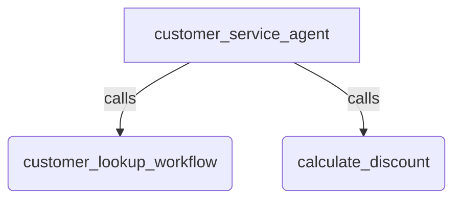

# Node as Tool

## Overview

Demonstrates wrapping both a regular ADK `Node` (using the `@node` decorator) and a `Workflow` as tools that can be automatically called by a parent `Agent`.

It also demonstrates how a node-based tool can pause execution for Human-in-the-Loop (HITL) input using `RequestInput` and resume dynamically.

In this sample:

1. The parent agent receives an inquiry about a customer's discount.
1. It invokes `customer_lookup_workflow` (a `Workflow` wrapped as a tool) to retrieve customer status.
1. It then invokes `calculate_discount` (a regular `Node` wrapped as a tool) using the retrieved status.
1. If the customer is a VIP, `calculate_discount` yields a `RequestInput` event to ask for confirmation. The invocation pauses and is resumed once the user provides input.

## Sample Inputs

- `What discount does customer c123 get?`

  *This is a multi-turn interaction demonstrating Human-in-the-Loop:*

  - *Turn 1: The parent agent invokes `customer_lookup_workflow` to verify status, then invokes `calculate_discount`. `calculate_discount` yields a `RequestInput` asking "Apply VIP discount for tier 'Verified VIP Member'?", which pauses the run.*
  - *Turn 2: Respond with `yes` to resume the run. It calculates the "20% off" discount, and the parent agent summarizes the results.*

## Agent Topology Graph

## How To

To expose an existing `Node` or `Workflow` as a tool callable by an `Agent`:

1. Define your `Node` (or `@node`) or `Workflow` and assign both an `input_schema` and a `description`.
1. Pass the node/workflow directly into your parent agent's `tools` list: `Agent(..., tools=[my_node, my_workflow])`.

## Related Guides

- [Workflows](../../../../docs/guides/workflows/workflows.md) - Explains building complex multi-step graphs.
